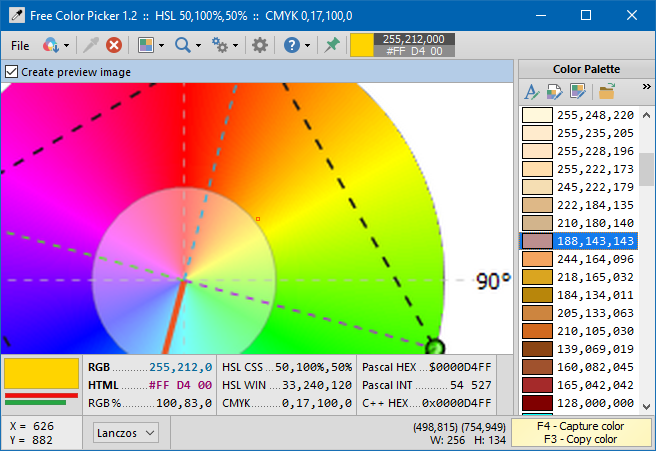
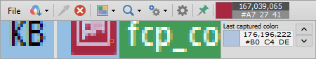
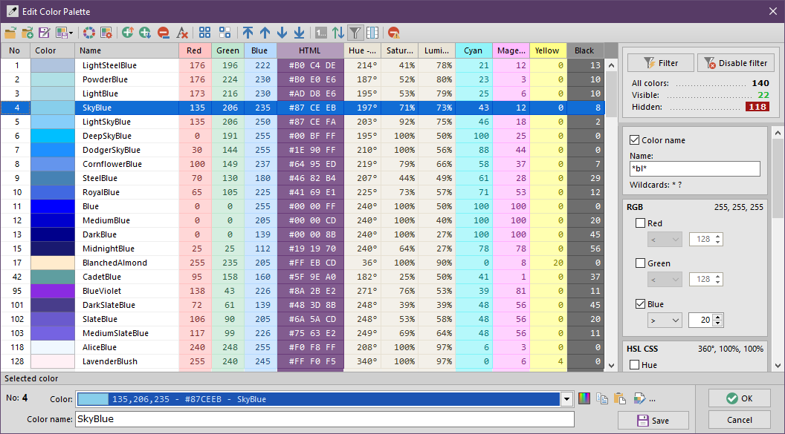
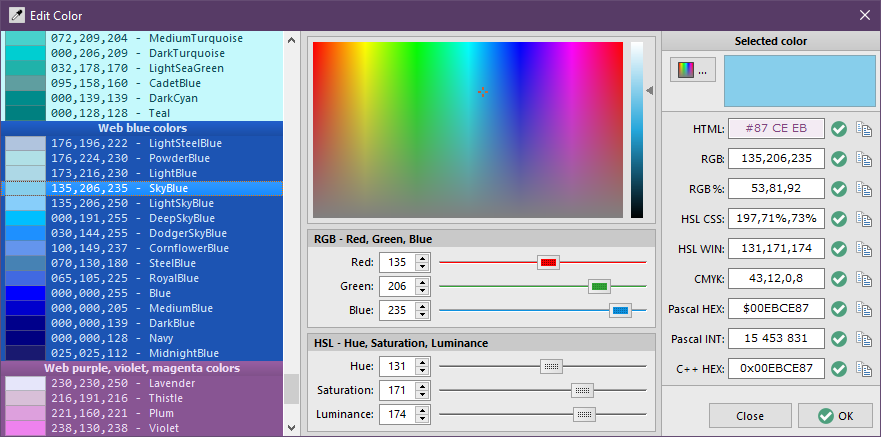
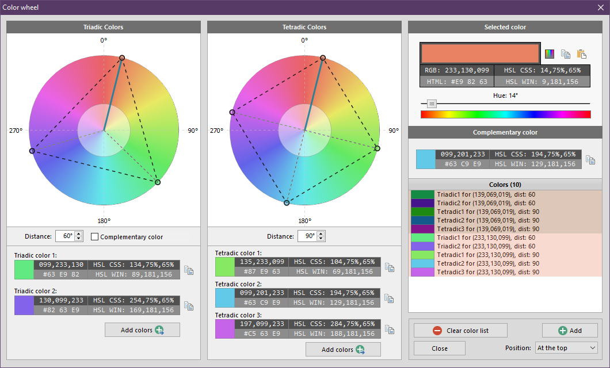
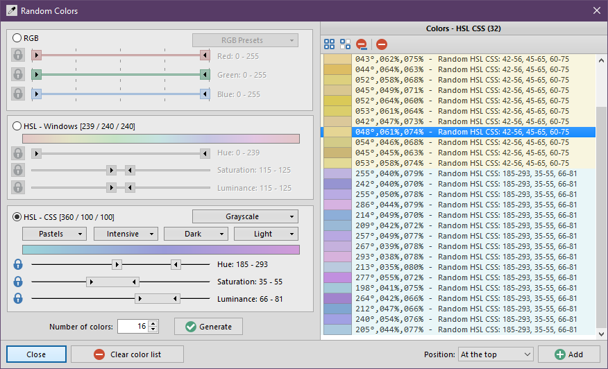
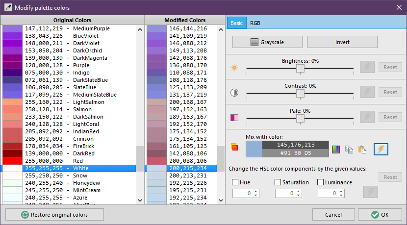

# Free Color Picker

An advanced color picker, screen magnifier and color palette manager.

## Download

Compiled executable files (32 and 64-bit for Windows) can be downloaded from the program website: [http://www.pazera-software.com/products/free-color-picker/](http://www.pazera-software.com/products/free-color-picker/)

## Overwiew

Free Color Picker is a program that lets you capture the color of any pixel displayed on the screen. To capture a color, just move the cursor to the desired position and press the **F4** key. The color below the cursor will be added to the color palette located in the right part of the main window.

To facilitate color capturing, there is a screen magnifier in the center of the main window that displays an enlarged image around the current cursor position. The maximum magnification is 30x.

Any captured color can be changed freely using the built-in color editor. In addition, the program allows easy modification of the entire color palette, sorting and filtering colors according to various criteria, generating random colors for user-specified ranges of RGB channel values and ranges of HSL component values, searching for triad colors on a color wheel and many more.

## Screenshots

### The main window

### The main window collapsed

### Color palette editor

### Color dialog

### Color wheel

### Random colors

### Modify color palette

## Program features

The most important functions of the program:

- Capturing the color of the pixel under the cursor (**F4** keyboard shortcut).
- Copy the color code under the cursor to the system clipboard in the format selected by the user (**F3** hotkey).
- Screen magnifier that enlarges the screen content around the current cursor position with a maximum magnification of 30x.
- The ability to set the algorithm used for zooming. The default algorithm - Box - does not change the color values. The other algorithms use color interpolation - they calculate the colors of empty pixels created after enlarging the image based on the colors of neighboring pixels in the original image. The most accurate, but also the slowest is the Lanczos algorithm.
- The ability to capture the pixel color at user-specified screen coordinates.
- Automatic capturing of color under the cursor at user-specified time intervals.
- The ability to pick-up colors from PNG, JPG, BMP and GIF graphic files opened in the program.
- Displaying color numeric codes and copying them in 9 popular formats used on websites and in various programming languages.
- Saving and loading color palettes in a proprietary format (JSON text files with the .colors extension) and in the format used by GIMP program (.gpl files).
- An advanced color palette editor that allows you to change the name and value of each color, sort, number, move, add and remove colors, insert colors from external files into the current palette.
- Advanced color palette sorting: by number, name, value, intensity of RGB channels, CMYK color space components (cyan, magenta, yellow, black) and HSL color space components (hue, saturation, brightness).
- The possibility of many modifications of the entire color palette: color conversion to grayscale, inversion, change of brightness, contrast, setting color fading, mixing each color of the palette with the selected color, changing the HSL components of each color by the given value, inversion of selected RGB channels, setting the value of selected channels RGB to a given fixed numeric value or their change by a given size.
- Generating random colors for user-specified ranges of RGB channel values and ranges of HSL component values.
- Generating gradient colors with given start and end colors.
- A color mixer calculating the color obtained after mixing the two colors given by the user.
- The color wheel of the HSL space with a graphical representation of the complementary, triadic and tetradic colors.
- *Drag and drop* support when opening color palette files and organizing colors in the *Color palette editor*.
- The ability to export a color palette to an HTML file with a color table for publication on websites.
- Built-in multi-language support mechanism based on INI text files with UTF-8 encoding. To write subsequent language versions, an ordinary text editor is sufficient, e.g. the system Notepad.
- The program is portable: it does not use the system registry, and all configuration data is saved in one INI file located in the program directory. The program can be copied to an external disk and used on another computer without any installation.
- The program is completely free, for private and commercial use.
